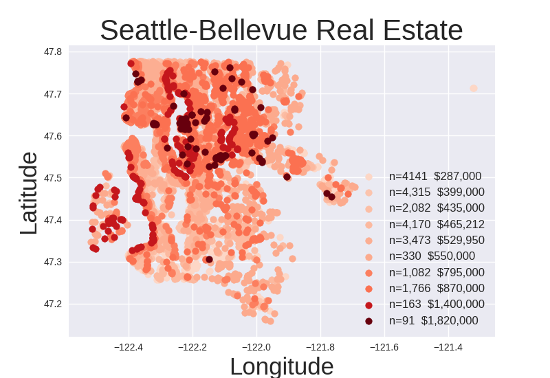

##Real Estate Case Study
###Kel Yip

In this dataset, there are approximately 21,000 recorded home sales ranging in price from  $83,000 to over $7 million.  Without looking at the zip codes, and plotting the longitude and latitude for each sale results in a map-like plot below (Figure 1):  

This plot resembles the Seattle area with respect to the open areas that are inlets of water.  Home sales were classified into 10 clusters based on feature characteristics.  The darker groupings represent more expensive homes.  As one can see from the coloration, waterfront homes and homes near water have higher prices.  Also homes that are at higher elevation with views to the water also are more expensive.    Figure 2 below shows waterfront and view home histograms of price per square feet.

On both a square footage and absolute price basis, waterfront homes command significantly higher prices.  The premium for views is less on a square foot basis, but view homes tend to be larger in general leading to higher overall price.

Below are scatter plots of home price vs various features (Figure 3).

For the quantitative variables, home price is positively correlated with living space, number of bathrooms, and grade.  Further clarification on what grade is necessary.  If one interprets grade as the steepness of the lot, this would imply that houses on edges of hillsides are more expensive than those on flat lots.  In real estate, location is always mentioned as an important determinant of home value.  Most likely longitude and latitude are very important in the determination of home price.

A random forest regressor was used to predict home prices from various feature vectors.  The first model used the following variables:

Index(['sqft_living', 'grade', 'lat', 'long', 'waterfront', 'sqft_living15',
       'age', 'sqft_above', 'sqft_lot15', 'sqft_lot', 'view',
       'renovation_recency', 'bathrooms', 'time', 'sqft_basement', 'bedrooms',
       'condition', 'month', 'floors'],
      dtype='object')
Several variables were constructed from the dataset, including renovation_recency -the time between date of home sale and year of last renovation, age - the time between date built and home sale date, and time - the number of days from the home sale date to the beginning of the dataset.

The training dataset included home sales up to January 1, 2015, and the test set after this date.  This resulted in about 14,000 training points and 7000 test points.

The resulting score was an R-squared of 0.86 an increase of 35 percentage points above the mean.  The model determined the most important features as listed above were living space, grade, latitude, longitude, and waterfront.

The second model included a minimal set of variable to achieve a score of .85:
Index(['sqft_living', 'grade', 'lat', 'long', 'waterfront'], dtype='object').  

The final test was to provide a confidence level for a customer with our prediction model.  For each observation in the test dataset, the model determined whether the actual sales price was within 10% of the model estimate.  The number of observations within the band divided by the number of observations is the expected probability that the customer’s selling price is within 10% of the model.<table>
<th>price_buckets</th><th>probability</th><th>count</th>
<tr><td>(0, 300000]</td><td>0.44</td><td>1450</td></tr>
<tr><td>(300000, 500000]</td><td>    0.53</td>   <td>2582</td></tr>
<tr><td>(500000, 700000]</td><td>    0.49 </td>  </td><td>1564</td></tr>
<tr><td>(700000, 1000000]</td><td>   0.46</td>    <td>907</td></tr>
<tr><td>(1000000, 6000000]</td><td>  0.29</td>    <td>477</td></tr>
</table>

It appears that the model provides higher confidence for homes that are between 300,000 and 500,000, with lower confidence for homes over $1 million.  This makes sense because homes in the upper price range have lower transaction volume with more volatile pricing.

Further work would be to determine if there are any time-related factors for home pricing.  Our variable time was not very predictive in this model.  The analysis found instances of same sale homes over time.  This information could be used to improve predictions especially for homes with prior sales information.  

| column | column |columns|
|--------|--------|-------
| dfsdsdf |   aa   	|      dfsdf
|dfdssdfds

sdf

